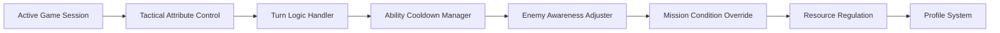

## Overview

XCOM 2 Trainer is an external control utility designed to interface with **active game sessions** and expose selected tactical, strategic, and numerical parameters for on-the-fly adjustment. The system operates through a modular control layer that manages turn logic, unit attributes, resource values, and rule-based checks during live play. Commonly associated systems include tactical modifiers, squad state controls, strategic resources, and action timing management. The trainer emphasizes deterministic behavior, stable value injection, and configurable feature scopes without touching core game files.

---

## Tactical Unit Attribute Control 🧬

* Editable health, armor, and shield values
* Aim, will, mobility, and defense scaling
* Per-unit or squad-wide application

**In-game behavior:**
Adjusts unit-level attributes mid-mission, enabling controlled recalibration of combat parameters while preserving overall encounter balance.

---

## Action Point & Turn Logic Handler 🔁

* Action point locking and restoration
* Turn-ending condition overrides
* Player-only or global scope selection

**Feature intent:**
Manages how turn logic is evaluated during live encounters, allowing extended or stabilized action sequences without breaking turn flow.

---

## Strategic Resource Regulation 📦

* Supplies, intel, alloys, and elerium editing
* Freeze, increment, or normalization modes
* Avenger-layer only enforcement

**In-game behavior:**
Controls strategic-layer counters during active management phases, keeping internal economy systems synchronized.

---

## Ability Cooldown & Charge Manager ⏱️

* Cooldown bypass or reduction
* Ability charge locking
* Individual skill targeting

**Feature intent:**
Reshapes how ability reuse is validated by internal timers and counters during missions, without altering ability definitions.

---

## Enemy Awareness & Detection Adjuster 👁️

* Fog-of-war interaction flags
* Detection radius scaling
* Activation state control

**In-game behavior:**
Alters how enemy units evaluate visibility and engagement triggers during movement and scouting phases.

---

## Mission Failure Condition Override 🚫

* Timer and objective suppression
* Loss-condition gating
* Mission-specific toggle logic

**Feature intent:**
Intercepts mission-ending checks and conditionally prevents premature termination based on configured rules.

---

## Configuration Profile System 💾

* Multiple saved presets
* Auto-load on launch or mission start
* Version-aware profile storage

**In-game behavior:**
Maintains consistent feature states across sessions, missions, and strategic layers with minimal reconfiguration.

---

---

## FAQ

**Are tactical and strategic systems handled separately?**
Yes, features are scoped to avoid cross-layer conflicts.

**Can attributes be applied to a single unit only?**
Both per-unit and squad-wide application modes are supported.

**Do changes persist after restarting the game?**
Only saved profiles persist; live-session values reset unless reapplied.

**Is enemy detection completely disabled?**
Detection behavior can be reduced or reshaped, not forcibly removed.

**Are cooldown changes applied globally?**
Cooldown control can be limited to selected abilities or units.

**Does this utility modify game files?**
No, all operations occur during live session execution only.

---

## Feature Summary

* Tactical unit attribute editing
* Action point and turn logic control
* Strategic resource management
* Ability cooldown and charge handling
* Enemy detection behavior adjustment
* Mission condition overrides
* Persistent configuration profiles

---
